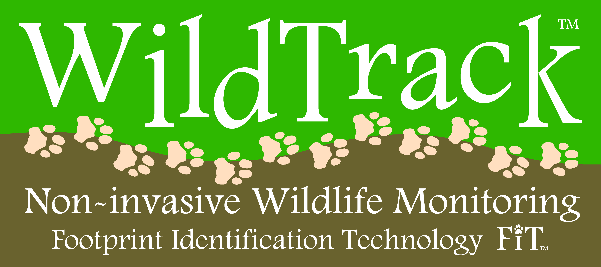

# w251-WildTrackAI
Footprint Identification for Wildlife Monitoring

## 1. Introduction  
  
WildTrack (https://wildtrack.org/) is a non-profit organization whose mission is to protect endangered species via non-invasive and cost-effective monitoring using footprints.   
Traditional wildlife monitoring techniques rely on fitting of instrumentation to an animal (transmitter on a collar, tag, insert), marking, capture or close visual observation, which have shown to have counterproductive effects on conservation efforts. WildTrack was founded on the premise that monitoring could be made safer and more efficient using non-invasive techniques based on the timehonored tradition of trail and footprint tracking used by indigenous trackers.  
At the heart of WildTrack's methodology is a specialized software FIT (Footprint Identification Technnology) based on SAS JMP technology. FIT maintains a  database for animals of various species being tracked, creating a unique profile for each individual based on morphometrics of the footprints. Once set up, researchers can use it to identify movement/ location of known individuals as well as identify and start tracking previously unknown individuals. More information on how FIT works can be found here: 
- https://wildtrack.org/wp-content/uploads/2017/03/FIT-Infographic-for-AZA-dw-1.pdf
- https://wildtrack.org/how-fit-works/

### 1.1 Project Goals
At the outset, the goals of this project were two-fold:
1. To identify and analyze WIldTrack's current paint points, exploring potential solutions.
2. After narrowing down to a valuable first set of opportunities to go after, implement an end-to-end proof of concept that addresses those opportunities. 

### 1.2 WildTrack current pain points and opportunities
This project focused on two main avenues in the overall WildTrack FIT workflow:
1. **Location of Trails:** Location of new trails and/ or areas to capture new footprint images is a highly  manual exercise involving classic geographic exploration techniques. More recently, Wildtrack has been experimenting with the use of fixed-wing drones for aerial image capture, but identifying trails on the images that these drones generate is still a manual , and unreliable process. 
2. **Pre-processing and profiling of footprints:** For a variety of reasons, raw images of footprints collected in the field still need a fair amount of processing before they are ready to be analyzed by FIT, which requires human labor.  The images need to be well formed and oriented in a certain way, and specific points (called landmarks) on the footprint need to be identified and measured in FIT before they can be used for downstream identification tasks. All in all, settting up FIT for a new area/preserve can take around 2 months per species. 
The founders of WildTrack are motivated to see this project apply AI techniques to help streamline the processes and activities listed above.  

### 1.3 Proposed Approach 
The proposed approach is to target an ideal solution, recognizing that it is likely beyond the scope of the first this project, but identify an initial project scope from within that solution that has value on its own, while serving as a basis for further work.  

#### 1.3.1 Ideal Solution
The ideal solution is real time identification and tracking  of wildlife by species and individual. Real time implies processing of images taken from a drone/ phone/ other camera as they are captured, with positive identification data being collected and organized centrally. It is dependent on the process being fully automated: i.e. being able to take on all the identification (species, individual) tasks that FIT does today without requiring any manual intervention (example: measurements, landmark identification, etc).

#### 1.3.2 Project Scope
This project uses state of the art Deep Learning techniques (specifically employing Convolutional Neural Networks)  for the Species CLassification and Individual Identification tasks desribed in the previous section. We outline these methods and select the most adequate model to be utilized at the edge, fulfilling requirements to be on-boarded on a portable device and/or drone for inference in real time. We also explore how wide range images captured via drones can be used to further improve the efficacy of Wildlife Tracking.  

Finally, we propose a practical implementation of an end to end solution using these methods on an edge device to collect and capture data saved in the cloud for further processing and model improvement.  

## 2. Overall Solution Architecture

## 3. Data Set and Processing
## 3.1 Base Images
Crop images and separate into test and train
## 3.2 Image Augmentation 

## 4. Model Development
### 4.1 Species Classification
#### 4.1.1 Model Evaluation & COmparison (Bona)
### 4.2 Individual Identification
### 4.3 Trail Identification
### 4.4 Footprint Detection. 

## 5. Pipeline (Mike)
### 5.1 Flowchart
### 5.2 Components
1. Cloud Training
2. Edge Inference
3. Edge Broker
4. Edge Forwarder
5. Cloud Broker
6. Cloud Reciver
7. Storage
8. Image Database
9. Front End Application
### 5.3 Front End (Dan, Jacques)
Geo tagging, meta data
Html file
Display footprint and information on map

## 6. Future Steps (Everyone)
- **Object Detection**: The team sees a real opportunity to streamline the image collection and inference process by implementing an object detection system whereby the model could detect footprints from images or videos taken from a further distance vs. closeup images taken at a very specific orientation. Subsequently, we envision an implementation similar to YOLO whereby the model could perform classification in realtime through the camera of a mobile device applying an object detection algorithm. 
- **Pipeline Optimization**: With the exception of the "intake" container, which loads the pretrained models and performs inference, the pipeline is very light, with the containers totalling ## MB. However, the intake container does require some additional work to reduce its' size to be more mobile-friendly. This could be achieved through the identification of a more mobile-friendly model, or through reconfiguring a streamlined container that can still perform the necessary functionality.
- Model Enhancement
- Productionalization
- Real-time Image Augmentation

## 7. Appendix. 
### 7.1 Note from WildTrack Founders  
  
Zoë Jewell *M.A., M.Sc., Vet. M.B., M.R.C.V.S*  
Sky Alibhai *D.Phil.*  
*Principal Research Associates, JMP software, SAS Institute*  
*Adjunct Faculty, Nicholas School of the Environment, Duke University*  
*Research Associates, University of Technology, Sydney.*  

WildTrack’s mission is to protect endangered species using non-invasive technologies. Our footprint identification technique (FIT) gives us high accuracy in classifying at the species and individual levels, but requires domain expertise to identify good data, and is labour-intensive.  As such, we struggle to process the increasing volumes of data required to mitigate species loss.

We presented Darragh Hanley’s research group with a huge challenge: To introduce automated classification into our system. Footprint images offer several unique AI challenges, for example, the background and object of interest (footprint impression) are effectively the same colour/texture and there are no clear boundaries between them. Also, many different variables impact on the footprint quality, resulting in considerable variation between each footprint made by an individual animal.  We presented the team with two different challenges; one was to identify species and the other, to identify individuals from footprint images. In both cases, they came up with very impressive levels of accuracy.

We have decades of experience working with footprints, and in the last 20 years have collaborated with many different academic groups trying to automate elements of our FIT process. **This is the first group with whom real progress has been made!**  Not only do they clearly have very strong and complementary skills, but (refreshingly) they came in with no assumptions, consulted very thoroughly with us about what we hoped to achieve, and made the effort to understand our domain. They approached the problem from our perspective and have at each stage considered how the outputs will integrate to form a practical field-based solution. Their results, achieved in a relatively short period of time, are better than we could possibly have expected and far surpass those of any other team we have worked with.

**Huge kudos go to this team!** We can’t praise their work highly enough and we’re excited to take this project forward together.

### 7.2 Implementation and Setup Details. 
### 7.3  References
