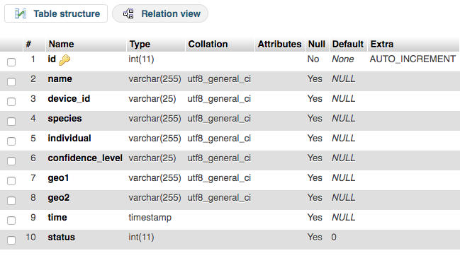

# Code Artifacts and Setup Instructions

## Data and Image Pre-Proessing  
The Raw Data Images are stored in a shared Google Drive (for ease of collaboration with WIldTrack founders) as well as on an S3 Mount.
The WildAID_PreProcess.ipynb in the "Models" subfolder of this repository is what we used to process these images to use as inputs for various models. 

## Model Development and Training  

Model development and training was mostly done on Google Colab (using the GPU/ High RAM option) for ease of collaboration across various team members and it's integration with Google Drive which was our primary means of collaboration with the WIldTrack Founders as well.   
ALl the word done during model development is captured in these notebooks (in the Models subfolder of this repository)

- Species Classification Model Training & Eval: WildAI_Species_Classification.ipynb
- Individal ID Model Training (Using Triples): WildAI_Individual_ID_Training.ipynb
- Individual ID Model Evaluation: WildAI_IndividualID_Evaluation.ipynb  

## Instructions for Configuring TX2
- **Step 1:** Clone this Repository
- **Step 2:** Download data and models to a local root directory on the TX2 called “WildAI”. These are all located in the following GDrive folder: https://drive.google.com/open?id=1srD-FnmRypFVtHqbn3vQSFDRgWDmJNkP. Note: It is important to preserve the subfolder structure (i.e. /WildAI/models; /WildAI/data).
- **Step 3:** Create a local network (i.e. "footprints") so that the edge-based docker containers can communicate.  
`docker network create --driver bridge footprints`
- **Step 4:** Create docker image and launch Edge Inference container. The Dockerfile is located in the w251-WildTrackAI/edge_inference directory. Note: the docker image for this container is based on an image called w251/tensorrt:dev-tx2-4.3_b132 available on Docker Hub. This image takes a while to build, so allow 30-40 mins. The volume created (-v) will give you access to the predict.py script necessary to perform inference.  
`docker build -t edge_inference -f Dockerfile.dev-tx2-4.3_b132-py3 .`  
`docker run –privileged -it --name edge_inference --network footprints -v /w251-WildTrackAI/edgeInference:/app -w /app edge_inference`
- **Step 5:** Create docker image and launch Edge Broker container. The Dockerfile is located in the w251-WildTrackAI/edgeMqttBrk directory. Note: upon running this container, Mosquitto will be launched automatically.  
`docker build -t edge_mqtt_broker .`  
`docker run --name edge_mqtt_broker --network footprints -p 1883:1883 edge_mqtt_broker`
- **Step 6:** Create docker image and launch Edge Forwarder container.  The Dockerfile is located in the w251-WildTrackAI/edgeMqttFor directory. The working directory (-w /app) command in the docker run script will launch the container directly into the appropriate directory to access the forwarding script, run.py.  
`docker build -t edge_mqtt_forwarder .`  
`docker run -it --name edge_mqtt_forwarder --network footprints -v /w251-WildTrackAI/edgeMqttFor:/app -w /app edge_mqtt_forwarder`

## Instructions for Configuring VSI
- **Step 1:** Create Virtual Server Instance (VSI)
- **Step 2:** Create a network (i.e. "cloud-wildtrack-ai") so that the cloud-based docker containers can communicate.  
`docker network create --driver bridge cloud-wildtrack-ai`
- **Step 3:** Create docker image and launch VSI Broker container. The Dockerfile is located in the w251-WildTrackAI/vsiMqttBrk directory. Note: upon running this container, Mosquitto will be launched automatically.  
`docker build -t vsi_mqtt_broker .`  
`docker run --name vsi_mqtt_broker --network cloud-wildtrack-ai -p 1883:1883 vsi_mqtt_broker`
- **Step 4:** Create docker image and launch VSI Receiver container.  The Dockerfile is located in the w251-WildTrackAI/vsiMqttRec directory. The first volume (-v) command in the docker run script will give you access to the s3 mounted directory for storing new files. The working directory (-w /app) command will launch the container directly into the appropriate directory to access the receiving script, vsi_receiver.py.  
`docker build -t vsi_mqtt_receiver .`  
`docker run -it --name vsi_mqtt_receiver --network cloud-wildtrack-ai -v /mnt/wildtrack-ai/new-files:/mnt/wildtrack-ai/new-files -v /w251-WildTrackAI/vsiMqttRec:/app -w /app edge_mqtt_forwarder`

## Instructions for Running Inference
The container setup for both the edge device and the cloud designates interactive (-it) mode and the appropriate volumes (-v) and working directories (-w) are established in the docker run scripts. Therefore, all that is left to do is call the python scripts associated with the VSI Receiver (vsi_receiver.py), Edge Forwarder (run.py), and Edge Inference(predict.py) containers from the command line and in that order. Inference should take about 5 minutes to complete.
`python3 vsi_receiver.py`  
`python3 run.py`  
`python3 predict.py`

## Instructions for the database

The database structure is as follow:

